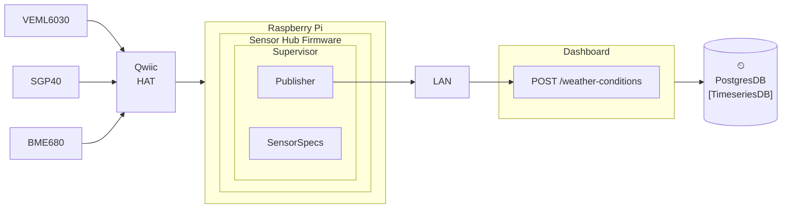

# Weather Station

**Status:** proof-of-concept, development/local environment only

**ToDo:** tests, liveview dashboard, security for running in production, externalizing config

# Description

This is a small experimental Nerves project to make a small weather station and display the summarized readings over time. It contains the two following projects:

### Sensor Hub

- This contains the nerves firmware and located within the `sensor_hub` directory. It uses the `publisher` and `veml6030` directories as dependencies.
- The `publisher` project handles starting up a supervisor that monitors the sensors and schedules publishing/posting sensor readings to the dashboard `/weather-conditions` endpoint. Additionally, it normalizes all sensor readings so measurements can be taken the same way, regardless of how interacting with a specific sensor differs behind the scenes.
- The `veml6030` project is a custom sensor-to-elixir mapping for all readings and actions that can be taken on the sensor. The other two sensors used in this project use external dependencies instead of this method.

### Dashboard

- This is a phoenix liveview project that has both a publishing endpoint used for sensor hub readings, as well as a work-in-progress dashboard to display available sensor readings.

# Dashboard

## Setup

Install dependencies after navigating into the dashboard directory:

```elixir
$ mix deps.get
```

Run docker compose to create the Postgres Timeseries DB:

```elixir
$ docker-compose up -d
```

Create database tables by running available migrations:

```elixir
$ mix ecto.create
$ mix.ecto.migrate
```

Start the server. It will run on port 4000 and accept incoming POST requests to /weather-conditions on a LAN:

```elixir
$ mix phx.server
```

**Note**: This is a work in progress and there is no visualization dashboard just yet. The initial version of this project just uses Grafana to visualize available data.

# Sensor Hub

## Hardware Requirements

This project has been created to work with the following:

- Raspberry Pi
- SparkFun Qwiic sensors + Hat
    - VEML6030 - Ambient light sensor
    - SGP40 - Air Quality Sensor
    - BME680 - Air Quality Sensor
- MicroSD Card

### Hardware Setup

- Connect Qwiic Hat to Raspberry Pi, and sensors via Qwiic cables to Hat on Raspberry Pi.
- Plug in MicroSD card to Raspberry Pi
- Connect USB cable to computer

## Firmware Setup

Modify the `:sensor_hub, :weather_tracker_url` value in `sensor_hub/config/target.exs` to point to the location of the `/weather-conditions` endpoint running from the dashboard project.

```elixir
config :sensor_hub, :weather_tracker_url, "http://192.168.1.187:4000/api/weather-conditions"
```

Export a MIX_TARGET environment variable, set to the iteration of RaspberryPi or other device the sensor hub will be used on:

```elixir
$ export MIX_TARGET=rpi4
```

Burn firmware and upload it:

```elixir
$ mix firmware
$ mix upload
```

Confirm the elixir shell is accessible on the device:

```elixir
$ ssh hub.local
```

**Note:** If any messages about SSH keys pop up, follow the instructions given. By default, the firmware installation may expect the device to be located at nerves.local instead of hub.local. After connecting at least once via SSH, this seems to update.

Once connected, debug logging can be viewed:

```elixir
iex> RingLogger.attach()
```

As soon as the firmware has been uploaded to the device, the supervisor should kick off the publisher and sensor readings, which will immediately start publishing to the dashboard backend every 10 seconds.

